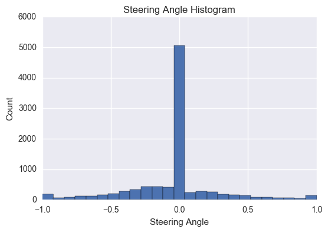
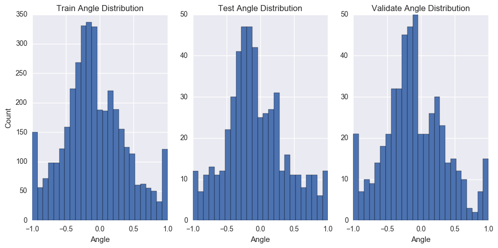
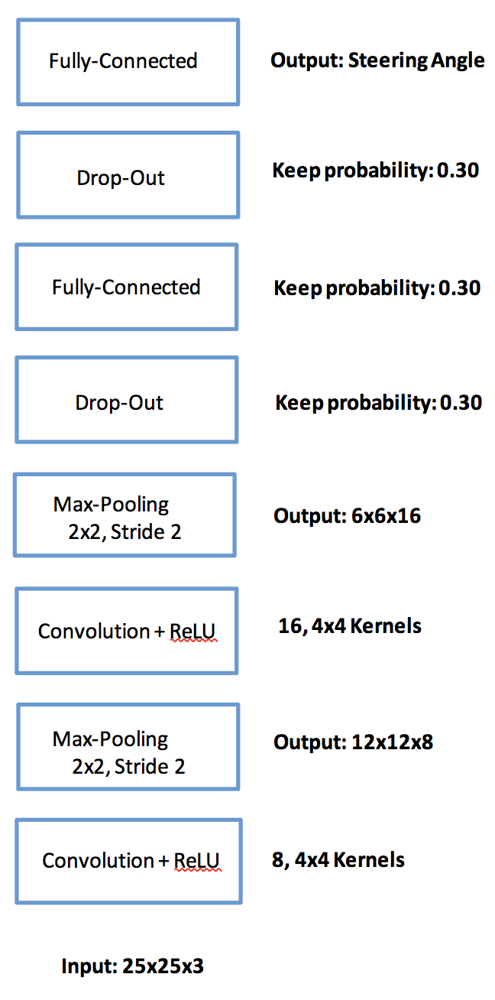

# Behavioral Cloning Project

## Data

To generate the data used for this project, I drove the car around both tracks for multiple laps (at least 4 laps around both tracks 1 and 2).  The driving involved both centerline driving as well as recovery from weaving out to the right and left edges of the road.  My driving generated a dataset of 9622 frames with their associated steering angles.  The graph below illustrates a histogram of the recorded steering angles.  The histogram shows that the steering angles are between -1 and 1 with a significant fraction of the steering angles equal to 0.  In fact, ~50% of the recorded frames are associated with a steering angle of zero.

The recorded frames (9622 frames) were **shuffled and split** into a training (7698 frames), testing (962 frames), and validation (962) sets.  Furthermore, only frames with non-zero steering angles were used to train, test, and validate the model.  The distribution of the train, test, and validation datasets are shown below.

## Model Architecture

Since the steering angle is a continuous number between -1 and 1, I chose to construct a convolutional neural network that performs regression from the input image frame (dimensions 25x25x3) to the steering angle (a continuous number).  My convolutional neural network uses an architecture that progressively transforms the input from a representation that is "wide and shallow" (e.g. input is 25 X 25 X 3 which is large in height and width relative to depth) to a representation that is "narrow and deep" (e.g. the output of my last convolutional layer is 6 X 6 X 16 which has greater depth than width and height). Each additional depth dimension is a learned feature map that helps the network solve the regression task.  Specifically, my architecture (shown in the figure below) contains two successive convolutional layers followed by two fully-connected layers. Each convolutional layer employs a ReLU activation function, and 2X2 max-pooling with a stride of 2 in each dimension. During training, the model is regularized by using two drop-out layers each with a keep-probability of 30%.

## Model Training and Evaluation

The model was trained using the Mean-Squared-Error (MSE) objective and the Adam optimization algorithm.  The model was trained for 25 epochs where each epoch involves presenting all the training data to the algorithm in batches of size 32.  The model achieved an training MSE error of 0.043, a testing MSE of 0.061, and a validation MSE 0.070.  The figure below illustrates a scatter plot of the model's predicted steering angle against the actual steering angle for both the test and validation data sets.

