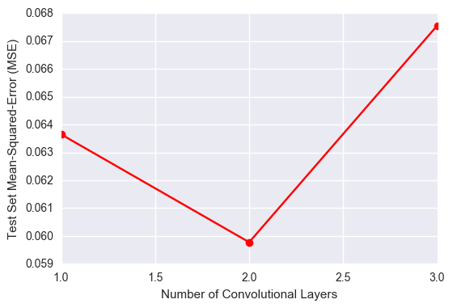

# Behavioral Cloning Project

## Data

To generate the data used for this project, I drove the car around both tracks for multiple laps (at least 4 laps around both tracks 1 and 2).  The driving involved both centerline driving as well as recovery from weaving out to the right and left edges of the road.  My driving generated a dataset of 9622 frames with their associated steering angles.  The graph below illustrates a histogram of the recorded steering angles.  The histogram shows that the steering angles are between -1 and 1 with a significant fraction of the steering angles equal to 0.  In fact, ~50% of the recorded frames are associated with a steering angle of zero.

The recorded frames (9622 frames) were shuffled and split into a training (7698 frames), testing (962 frames), and validation sets (962 frames).  Furthermore, only frames with non-zero steering angles were used to train, test, and validate the model.  This was done to focus the learning process on predicting a range of steering angles as opposed to focusing on correctly predicting the large number of instances with a steering angle of zero.  Finally, all image frames were reshaped to be smaller (25x25x3) so as to speed up the training process (since convolution is O(N^2) operation).  The distribution of the steering angles in the train, test, and validation datasets are shown below.  

## Model Architecture

Since the steering angle is a continuous number between -1 and 1, I chose to construct a convolutional neural network that performs regression from the input image frame (dimensions 25x25x3) to the steering angle (a continuous number).  My convolutional neural network uses an architecture that progressively transforms the input from a representation that is "wide and shallow" (e.g. input is 25 X 25 X 3 which is large in height and width relative to depth) to a representation that is "narrow and deep" (e.g. the output of my last convolutional layer is 6 X 6 X 16 which has greater depth than width and height). Each additional depth dimension is a learned feature map that helps the network solve the regression task.  

More specifically, my architecture (shown in the figure below) first normalizes the data using a batch normalization layer.  Next, the model passes the data through two successive convolutional layers followed by one fully-connected layer. Each convolutional layer uses 4x4 kernels, employs a ReLU activation function, and is followed by a 2X2 max-pooling layer with a stride of 2 in each dimension. During training, the model is also regularized by using two drop-out layers each with a keep-probability of 30%.

## Model Architecture Exploration

I arrived at the model architecture described above through a greedy exploration process.  I first fixed the number of fully-connected layers to 1 and evaluted the model's Mean-Squared-Error (MSE) on the test set as the number of convolutional layers increased form 1 to 3.  The plot below illustrates how the model's test MSE has a local minimum when using two convolutional layers.

Next, with the number of convolutional layers fixed to two, I evaluated the model's test MSE as the number of fully-connected layers increased form 1 to 3.  In this case, the figure below illustrates that the addition of more fully-connected layers worsens the test MSE.

Based on the above test set results, I fixed the model architecture to use two convolutional layers and one fully-connected layer as illustrated in the model architecture figure of the previous section.

## Model Training and Evaluation

The model was trained using the Mean-Squared-Error (MSE) objective and the Adam optimization algorithm.  The MSE is a suitable objective for a regression task while the Adam optimizer's adaptive learning rate and momentum promote model convergence.  The model was trained for 25 epochs where each epoch involves presenting all the training data to the algorithm in batches of size 32.  The model achieved an training MSE error of 0.043, a testing MSE of 0.061, and a validation MSE 0.069.  The relative closeness of the test and validtion MSE values suggests that we did not overfit to the test set while exploring model architectures.  The figure below illustrates a scatter plot of the model's predicted steering angle against the actual steering angle for both the test and validation data sets.

## Autonomous Mode

The model successfully guides the car around track 1.

